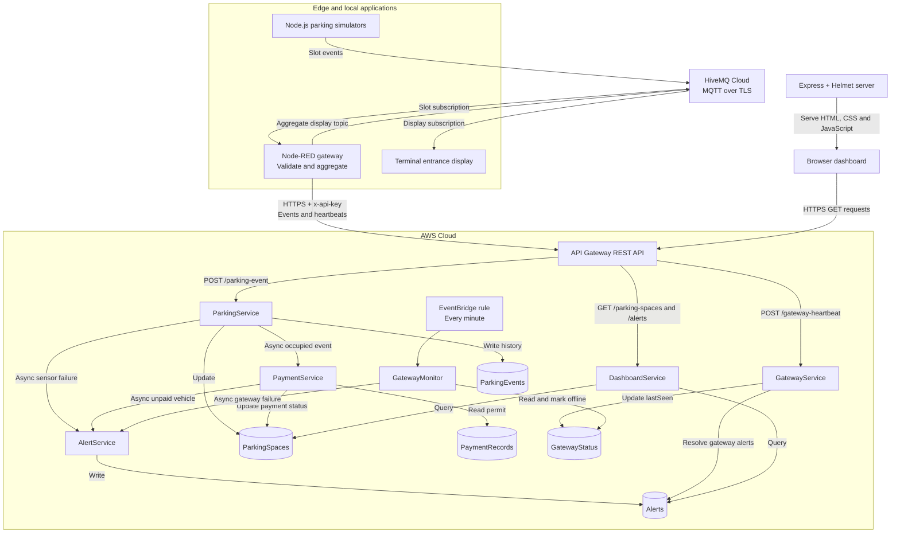

# Smart Parking System

An IoT smart parking prototype combining Node.js sensor simulation, MQTT messaging, Node-RED edge processing, and AWS serverless services. It tracks parking occupancy, checks stored payment or permit status, generates alerts, and monitors gateway availability.

Developed in the context of **SIT314 at Deakin University**, the project demonstrates an event-driven edge-to-cloud system. Parking sensors, licence plates, LEDs, and the entrance display are simulated; the repository does not include physical hardware or a payment processing integration.

## Features

- **Parking node simulation:** configurable slot, plate number, and sensor status; random occupied/available events every two seconds.
- **MQTT over TLS:** MQTT.js clients connect to HiveMQ Cloud on port `8883`.
- **Edge validation:** Node-RED rejects missing fields, invalid occupancy values, occupied events without a plate, invalid timestamps, duplicate events, and outdated events.
- **Local aggregation:** accepted events update occupancy totals and an MQTT-connected terminal entrance display.
- **Cloud persistence:** current slot state and event history are stored separately in DynamoDB.
- **Asynchronous services:** occupied events trigger permit checks; unpaid vehicles and sensor failures trigger alerts.
- **Gateway monitoring:** ten-second heartbeats, a scheduled monitor, offline alerts, and automatic resolution of gateway alerts after recovery.
- **Web dashboard:** Express and Helmet serve a browser interface that refreshes parking and alert data every five seconds.
- **Repeatable cloud tests:** concurrent ingestion tests and downstream payment/alert verification.

## Architecture



### Event processing

1. Each simulator publishes JSON to `smartparking/PARK-A/slots/<slotID>`.
2. Node-RED subscribes to `smartparking/PARK-A/slots/+`, validates the event, and remembers the latest accepted timestamp and signature per parking lot/slot.
3. Accepted events branch into local aggregation and cloud forwarding. Totals are published to `smartparking/PARK-A/display`; individual events are sent to `POST /parking-event`.
4. `ParkingService` updates `ParkingSpaces`, writes `ParkingEvents`, and asynchronously invokes `PaymentService` for occupied slots. Non-working sensors also trigger `AlertService`.
5. `PaymentService` reads `PaymentRecords` by plate number, changes the slot payment status from `checking` to `valid` or `unpaid`, and requests an unpaid-vehicle alert when needed.
6. The browser queries the cloud API and shows occupancy, plates, payment/permit status, and active alerts.

The entrance display depends on MQTT and Node-RED, not successful AWS requests. Its totals count slots observed by the running gateway, rather than a preconfigured physical capacity.

### Gateway health

Node-RED sends a heartbeat every **10 seconds**. `GatewayService` records `lastSeen`, marks the gateway online, and resolves its active `gateway_failure` alerts. The EventBridge rule invokes `GatewayMonitor` every **one minute**. The monitor marks a previously online gateway offline when its heartbeat is more than **30 seconds** old and invokes `AlertService`.

Detection happens on a scheduled check, so the 30-second threshold is not a 30-second notification guarantee. A gateway must first have a record in `GatewayStatus` to be monitored.

## Technology stack

| Area | Technologies |
| --- | --- |
| Simulators and display | Node.js, MQTT.js |
| Messaging | HiveMQ Cloud, MQTT over TLS |
| Edge gateway | Node-RED core MQTT, JSON, Function, Inject, and HTTP Request nodes |
| Cloud API | Amazon API Gateway REST API, API keys for POST methods |
| Services | AWS Lambda, JavaScript ES modules, AWS SDK for JavaScript v3 |
| Storage | Amazon DynamoDB, on-demand billing |
| Monitoring | Amazon EventBridge scheduled rule, Lambda, CloudWatch logs |
| Dashboard | Express 5, Helmet 8, HTML, CSS, browser JavaScript |
| Configuration and tests | `.env`, Node.js environment loading, dotenv-cli, native `fetch` |

## Repository structure

```text
SmartParkingHD/
├── README.md
├── .env.example
├── .gitignore
├── package.json                  # dotenv-cli for environment-aware launches
├── package-lock.json
├── simulators/
│   ├── parking_node.js           # Parking event generator
│   ├── entrace_display.js        # Terminal display (filename as committed)
│   ├── mqtt_config.js            # Shared TLS connection and .env loading
│   ├── mqtt_publisher.js         # MQTT helper
│   ├── mqtt_subscriber.js        # MQTT helper
│   ├── invalid_test.js           # Invalid-status test; see testing note
│   ├── package.json
│   └── package-lock.json
├── edge/node-red/flows.json      # Importable gateway flow
├── dashboard/
│   ├── server.js                 # Express static server and Helmet policy
│   ├── index.html
│   ├── script.js                 # Browser API requests and five-second refresh
│   ├── style.css
│   ├── package.json
│   └── package-lock.json
├── aws/
│   ├── lambda/
│   │   ├── ParkingService/index.mjs
│   │   ├── PaymentService/index.mjs
│   │   ├── AlertService/index.mjs
│   │   ├── DashboardService/index.mjs
│   │   ├── GatewayService/index.mjs
│   │   └── GatewayMonitor/index.mjs
│   ├── dynamodb/                # Five table-description exports
│   ├── api-gateway/SmartParkingAPI-dev-oas30-apigateway.json
│   └── eventbridge/
│       ├── GatewayMonitorSchedule.json
│       └── GatewayMonitorSchedule-targets.json
└── testdata/
    ├── load_test.js
    └── full_pipeline_test.js
```

## Prerequisites

- Node.js **24 or later** and npm, matching the repository's setup baseline. Simulator configuration uses `process.loadEnvFile`; tests use native `fetch`.
- Git and a Node-RED installation available as `node-red`.
- A HiveMQ Cloud broker and credentials with access to the slot and display topics.
- An AWS deployment containing the services, tables, API, and monitoring rule described below.
- A valid API Gateway key associated with the deployed stage through a usage plan.
- Network access to the broker over TLS and the AWS HTTPS API.

## Local setup and configuration

### 1. Install dependencies

```sh
git clone https://github.com/kent1306/SmartParkingHD.git
cd SmartParkingHD
npm ci
npm --prefix simulators ci
npm --prefix dashboard ci
npm install --global node-red
```

Skip the last command if Node-RED is already installed. All subsequent commands run from the repository root unless stated otherwise.

### 2. Create the private environment file

Copy `.env.example` to `.env`. For PowerShell:

```powershell
Copy-Item .env.example .env
```

For macOS/Linux:

```sh
cp .env.example .env
```

The committed `.env.example` contains placeholders only:

```dotenv
SMART_PARKING_API_KEY=YOUR_API_KEY_HERE
MQTT_HOST=YOUR_MQTT_HOST
MQTT_USERNAME=YOUR_MQTT_USERNAME
MQTT_PASSWORD=YOUR_MQTT_PASSWORD
```

| Variable | Purpose |
| --- | --- |
| `SMART_PARKING_API_KEY` | `x-api-key` header for cloud event and heartbeat POSTs; also used by the test scripts |
| `MQTT_HOST` | Broker hostname only, without `mqtts://` or a port |
| `MQTT_USERNAME` | MQTT account username |
| `MQTT_PASSWORD` | MQTT account password |

Simulator programs load the root `.env` through `mqtt_config.js`. Node-RED and the cloud tests receive environment variables through the launch commands below. Node-RED's imported broker node must be configured separately; it does not automatically use the simulator's MQTT settings.

Keep `.env`, credentials, private flow credential files, and API key values out of Git and screenshots. The repository's `.gitignore` excludes `.env` while allowing `.env.example`.

### 3. Point the applications at your deployment

The current implementation stores deployment URLs in source/configuration, rather than reading an API URL environment variable. When deploying your own API, update:

| File/location | Required change |
| --- | --- |
| `edge/node-red/flows.json`, HTTP Request nodes | Event and heartbeat URLs |
| `dashboard/script.js` | `API_BASE_URL`, including the stage |
| `dashboard/server.js` | Helmet `connect-src` API origin, without the stage path |
| `testdata/load_test.js` | `API_URL`, including `/parking-event` |
| `testdata/full_pipeline_test.js` | `API_BASE_URL`, including the stage |
| Node-RED MQTT broker configuration | Your broker hostname, TLS settings, and private credentials |

Use a base URL shaped like `https://<api-id>.execute-api.<region>.amazonaws.com/<stage>`. Adding an `API_BASE_URL` entry to `.env` alone will not change these hard-coded settings.

## Run the system

### Node-RED gateway

```sh
npx dotenv -e .env -- node-red
```

Open `http://localhost:1880`, import `edge/node-red/flows.json`, and configure the MQTT broker with your hostname, port `8883`, TLS enabled, and private username/password. Keep certificate verification enabled. Update both cloud request URLs and deploy the flow. The API key Function nodes read `env.get("SMART_PARKING_API_KEY")`.

Check that MQTT nodes report a connection and heartbeat requests succeed. Restart Node-RED after changing the process environment.

### Entrance display and simulators

Run each command in a separate terminal:

```sh
node simulators/entrace_display.js
node simulators/parking_node.js A01 ABC123 working
node simulators/parking_node.js A02 OYF789 working
```

Simulator arguments are `slotID`, optional fixed plate, and optional sensor status. Defaults are `A01`, a randomly generated plate, and `working`. A fixed plate applies only when the randomly selected state is occupied; it does not force occupancy.

To exercise the sensor failure path:

```sh
node simulators/parking_node.js A03 TEST123 failed
```

The display prints total, occupied, and available observed spaces. Stop long-running local programs with `Ctrl+C`.

### Dashboard

```sh
node dashboard/server.js
```

Open `http://localhost:3000`. Express serves the assets; the browser calls API Gateway directly. No API key belongs in the browser code. The committed API export leaves the two GET methods without an API-key requirement, and `DashboardService` returns a wildcard CORS origin.

## AWS deployment notes

The `aws/` directory contains Lambda source and configuration exports, **not a complete infrastructure-as-code deployment**. Account-specific ARNs and integration targets must be replaced for a new environment. Table-description exports are references for table creation, not ready-to-run `create-table` input or data backups.

1. **Create DynamoDB tables** using the following string keys and on-demand billing:

   | Table | Partition key | Sort key | Purpose |
   | --- | --- | --- | --- |
   | `ParkingSpaces` | `parkingID` | `slotID` | Latest slot state and payment result |
   | `ParkingEvents` | `parkingID` | `eventID` | Event history; ID is timestamp plus slot ID |
   | `PaymentRecords` | `plateNumber` | — | Stored payment/permit lookup |
   | `Alerts` | `parkingID` | `alertID` | Active and resolved alerts |
   | `GatewayStatus` | `gatewayID` | — | Gateway status and last heartbeat |

2. **Deploy the six Lambda functions** with the exact directory names and handler `index.handler`. Use a supported Node.js runtime with the required AWS SDK v3 modules available, or package those dependencies explicitly. Table and invoked function names are hard-coded in the source.
3. **Assign least-privilege execution roles** and CloudWatch logging permissions. `ParkingService` writes slot/history data and invokes payment/alert services; `PaymentService` reads permits, updates slots, and invokes alerts; `AlertService` writes alerts; `DashboardService` queries slots/alerts; `GatewayService` updates gateway state and queries/updates alerts; `GatewayMonitor` scans/updates gateway state and invokes alerts.
4. **Configure API Gateway** from the OpenAPI export, replacing Lambda integration ARNs and granting API Gateway permission to invoke the functions. Deploy a stage, require API keys on both POST methods, and associate a private key with that stage through a usage plan.
5. **Configure the EventBridge rule** `GatewayMonitorSchedule` with `rate(1 minute)`, targeting `GatewayMonitor`. Update the exported target ARN and grant EventBridge permission to invoke the function.
6. **Seed demonstration permits.** For the bundled pipeline test, create a `PaymentRecords` item with `plateNumber: "ABC123"`, `paymentStatus: "valid"`, and `permitType: "student"`. Ensure `OYF789` has no valid record. Seed items are not supplied by the table exports.
7. Update local endpoints, configure credentials privately, and verify the pipeline using the checks below.

## API endpoints

Paths are relative to the deployed API stage.

| Method | Path | Lambda | API key | Behaviour |
| --- | --- | --- | --- | --- |
| POST | `/parking-event` | `ParkingService` | Required | Save current state/history; trigger downstream processing |
| POST | `/gateway-heartbeat` | `GatewayService` | Required | Mark online, save heartbeat, resolve gateway alerts |
| GET | `/parking-spaces` | `DashboardService` | Not required in export | Query slots for `PARK-A` |
| GET | `/alerts` | `DashboardService` | Not required in export | Query alerts for `PARK-A`, including resolved alerts |

POST requests use `Content-Type: application/json` and an `x-api-key` header supplied privately by the caller.

Example parking event, using synthetic data:

```json
{
  "parkingID": "PARK-A",
  "slotID": "A01",
  "deviceID": "NODE-A01",
  "status": "occupied",
  "plateNumber": "ABC123",
  "LEDstatus": "red",
  "timestamp": "2026-09-27T10:00:00.000Z",
  "sensorStatus": "working"
}
```

Use a fresh ISO 8601 timestamp when sending an event. Available slots use `status: "available"`, `plateNumber: null`, and `LEDstatus: "green"`. Supply all fields shown: although `LEDstatus` is not checked by the required-field validator, the cloud update uses it.

Example heartbeat:

```json
{
  "gatewayID": "GATEWAY-PARK-A",
  "parkingID": "PARK-A",
  "timestamp": "2026-09-27T10:00:00.000Z"
}
```

Successful event POSTs return HTTP `200` with a message, `parkingID`, and `slotID`. This acknowledges initial processing; payment and alert completion are asynchronous. GET responses have the shape `{ "type": "parkingSpaces", "count": 0, "data": [] }` or the equivalent with `type: "alerts"`. The browser filters alerts to `status === "active"`.

Missing required fields and invalid parking status can return `400`; service failures return `500`. Malformed JSON currently reaches the generic error handler. A missing or invalid API key should be rejected by API Gateway before Lambda invocation.

## Testing and expected outcomes

Run cloud tests only against your configured test deployment: they create DynamoDB records and may incur AWS usage charges. The scripts do not clean up their records. The package `npm test` commands are placeholders; use the explicit commands below.

### 1. MQTT-to-dashboard demonstration

Start Node-RED, the entrance display, a simulator, and the dashboard. Confirm slot messages reach Node-RED, display totals change, cloud slot/history records appear, and the browser reflects the slot state on a subsequent refresh.

| Scenario | Expected observation |
| --- | --- |
| Occupied slot with seeded `ABC123` | Payment moves from `checking` to `valid`; permit type is `student` |
| Occupied slot with unregistered `OYF789` | Payment becomes `unpaid`; an `unpaid_vehicle` alert appears |
| Available slot | Current payment fields are removed from the slot record |
| `sensorStatus: "failed"` | A `sensor_failure` alert is created |
| Stop heartbeat after at least one successful heartbeat | A later monitor run marks the gateway offline and creates a `gateway_failure` alert |
| Restore heartbeat | Gateway becomes online and its active gateway alerts become resolved |

### 2. Edge rejection checks

The bundled invalid-message helper currently publishes to `smartparking/PARK-A/A01`, which does **not** match the gateway subscription. In your test copy, change its topic to `smartparking/PARK-A/slots/A01` before running:

```sh
node simulators/invalid_test.js
```

Its `status: "busy"` should produce `Rejected: Invalid parking status` in Node-RED and should not reach the cloud branch.

For duplicate/outdated checks, pause the simulator for the chosen slot. Using an MQTT client, publish a valid event with a fresh timestamp to the slot topic, then publish the exact same event again, followed by an older timestamp. Node-RED should report `Rejected: Duplicate event` and `Rejected: Outdated event`, respectively. An equal timestamp with a different signature is also rejected as outdated. Test missing fields, missing occupied plate, and invalid timestamps similarly.

These checks apply to the Node-RED path. Direct API POSTs bypass edge duplicate/outdated filtering.

### 3. Concurrent ingestion load test

```sh
npx dotenv -e .env -- node testdata/load_test.js 10
npx dotenv -e .env -- node testdata/load_test.js 50
npx dotenv -e .env -- node testdata/load_test.js 100
```

The accepted request counts are `10`, `50`, and `100`; the default is `100`. Requests run concurrently using unique `LT-...` slot IDs and available-slot events, avoiding same-item contention and payment processing.

Expected success summary for 100 requests:

```text
Load Test Summary
Total requests: 100
Successful: 100
Failed: 0
```

The script also prints per-request status/duration, total elapsed time, and average duration. These are measurements from your run, not fixed expected values. Inspect the summary: the current load test does not set a failing exit code when individual requests fail.

### 4. Cloud pipeline test

Ensure the permit fixtures described above exist, then run:

```sh
npx dotenv -e .env -- node testdata/full_pipeline_test.js
```

This sends **20 concurrent occupied events**, alternating the valid and unpaid plates. It uses unique `FULL-...` slot IDs and polls the dashboard APIs up to eight times at two-second intervals to observe downstream results.

Expected successful output includes:

```text
Total requests: 20
Successful: 20
Failed: 0

Full Pipeline Verification
Parking records: 20 / 20
Valid payments: 10 / 10
Unpaid payments: 10 / 10
Alerts created: 10 / 10

FULL PIPELINE TEST PASSED
```

The alert count represents **unique unpaid slots with matching alerts**, not a guarantee that exactly ten alert rows exist. Failed initial requests skip downstream verification; incomplete verification sets a nonzero exit code.

Despite its filename, this test starts at API Gateway. It verifies cloud ingestion, payment outcomes, and alert visibility through the read API; it does not exercise MQTT, Node-RED, the entrance display, gateway monitoring, or directly assert event-history rows. Use the separate checks above for those components.

### Troubleshooting

| Symptom | Check |
| --- | --- |
| MQTT cannot connect | Broker hostname, credentials, port `8883`, TLS configuration, and topic permissions |
| POST returns `403` | API key, usage-plan/stage association, and the deployed URL |
| Browser fetch is blocked | API URL, CORS response, and matching Helmet `connect-src` origin |
| Payment test produces no valid slots | Seed `ABC123` as valid with a permit type; inspect PaymentService logs and permissions |
| Pipeline test remains incomplete | Lambda logs, async completion, read permissions, and query pagination limitations |
| Invalid-message test produces no rejection | Correct the helper's topic to include `/slots/` |

## Scalability summary

The architecture separates edge processing, HTTP ingestion, payment checks, alerts, and reads. Lambda functions can scale independently within configured quotas, and the exported DynamoDB tables use on-demand billing. MQTT decouples publishers from consumers; rejecting duplicates and outdated events at the edge avoids unnecessary cloud work. Aggregation supports the local display, while every accepted event is still forwarded individually.

The load script supports comparative bursts of 10, 50, and 100 requests. The pipeline script checks downstream results for a 20-event burst. Neither establishes sustained throughput, MQTT broker capacity, same-slot concurrency correctness, or a production service-level guarantee. No benchmark result logs are committed with the inspected source, so this README reports test capabilities and expected outcomes rather than unverified performance figures.

For assessment evidence, record the commit, deployment settings, request count, successes/failures, total duration, average duration, and downstream completion for each actual run.

## Current limitations

- **Prototype scope:** occupancy is random, the entrance display is a terminal program, and payment validation is a stored status lookup. There is no charging workflow or permit-expiry validation.
- **Single-lot assumptions:** topics, dashboard queries, and examples use `PARK-A`; multi-lot configuration requires code/flow changes.
- **Edge-only ordering protection:** deduplication uses Node-RED flow context. Persistence is not configured by the exported flow, and default in-memory state is lost on restart. Cloud updates have no timestamp condition or end-to-end idempotency guarantee.
- **Delivery and consistency:** simulator publishes use default MQTT QoS 0. The flow has no explicit durable cloud retry queue. State/history writes and asynchronous invocations are not one transaction; payment updates are not guarded against a newer occupancy event.
- **Alert lifecycle:** gateway alerts resolve on recovery. Unpaid and sensor alerts are not automatically resolved, and repeated events can create repeated alerts.
- **Read scaling:** DynamoDB queries/scans do not paginate. Larger datasets can yield incomplete dashboard results, monitoring, alert resolution, or test observations. Test-generated slots also contribute to cloud dashboard totals until removed.
- **Security scope:** TLS protects MQTT transport; API keys protect the POST methods in the export; Helmet adds browser security headers. There is no user login or per-user authorization, GET data is public in the exported configuration, and API keys are not a complete authentication system. Table rows are inserted through `innerHTML`, so untrusted display values require further hardening.
- **Deployment and operations:** configuration exports do not provision a complete environment, and deployment URLs are embedded in source. Automated cleanup, retention, CI testing, and production recovery controls are not included.

## Academic context and acknowledgements

This repository supports a SIT314 smart parking project at Deakin University, demonstrating IoT messaging, edge validation, serverless services, and distributed-system testing. It uses Node.js, MQTT.js, Node-RED, HiveMQ Cloud, Express, Helmet, and AWS services. It is a student prototype and does not imply endorsement by these organisations.

Use synthetic plates and placeholder credentials in submitted examples. Include measured test outputs and any required course acknowledgements or declarations with the assessment report. Package metadata declares ISC in the root/dashboard manifests; the inspected repository does not contain a standalone `LICENSE` file.

---

Implementation reference: [SmartParking repository](https://github.com/kent1306/SmartParking), inspected at commit [`1cd8b725`](https://github.com/kent1306/SmartParking/tree/1cd8b7255934c963a38daee39d525f5312156663). Expected outcomes above are acceptance criteria, not a claim that the live deployment was tested while preparing this README.
